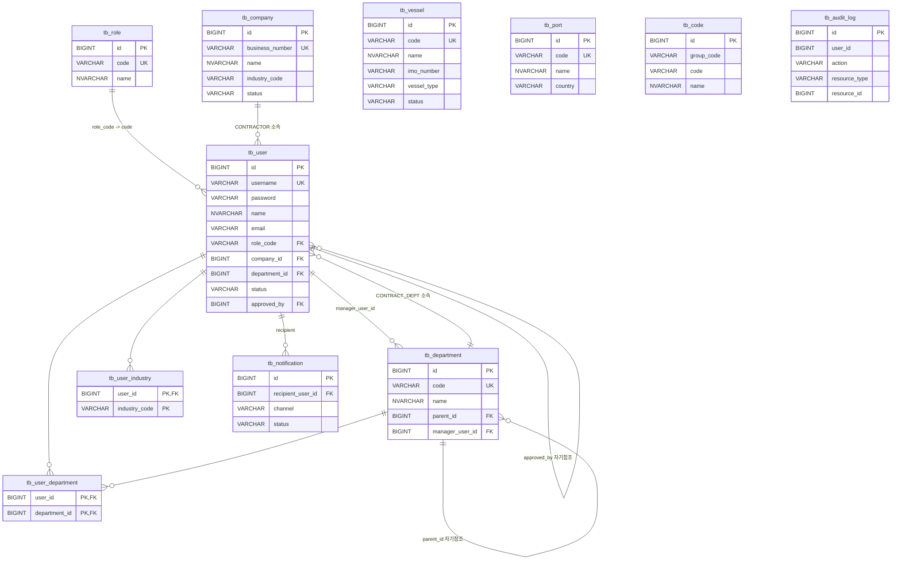

# 팬오션 안전보건 DX - Phase 1 ERD

Phase 1 공통 스키마 범위 (V1 기준)의 관계도입니다.
업무 테이블 (안전수칙/협력업체 평가 등) 은 Phase 2 이후 별도 문서로 확장합니다.

## 전체 관계도

## 핵심 관계 요약

| 관계 | 설명 |
|------|------|
| tb_user.role_code → tb_role.code | 모든 사용자는 정확히 하나의 role |
| tb_user.company_id → tb_company.id | CONTRACTOR 전용 (NULL 허용) |
| tb_user.department_id → tb_department.id | CONTRACT_DEPT 또는 ADMIN 용 (NULL 허용) |
| tb_user.approved_by → tb_user.id | 승인 처리 관리자 (NULL = 미승인) |
| tb_department.parent_id → tb_department.id | 조직 계층 |
| tb_department.manager_user_id → tb_user.id | 부서장 |
| tb_user_department | N:M 사용자-부서 (한 명이 여러 계약팀 담당) |
| tb_user_industry | N:M 사용자-업종 (tb_code(group_code='INDUSTRY')) |
| tb_notification.recipient_user_id → tb_user.id | 알림 수신자 |

## 설계 노트

- `tb_audit_log.user_id` 는 **soft link** (FK 없음): 계정이 삭제되어도 로그는 보존.
- `industry_code` 는 FK 제약 대신 `tb_code(group_code='INDUSTRY')` 참조 규약. 리포트성 조인은 `LEFT JOIN tb_code c ON c.group_code='INDUSTRY' AND c.code = x.industry_code` 형태로.
- `deleted BIT` = 논리 삭제. 서비스 레이어 모든 SELECT 는 `deleted = 0` 필터 필수.
- 타임스탬프는 **UTC (`SYSUTCDATETIME()`)** 저장. 표시 시 KST 변환.
- Phase 2+ : 업종별 안전수칙(`tb_safety_rule`), 협력업체 14개 항목 평가(`tb_contractor_eval` / `tb_contractor_eval_item`), 선박별 작업계획 등이 추가될 예정.
